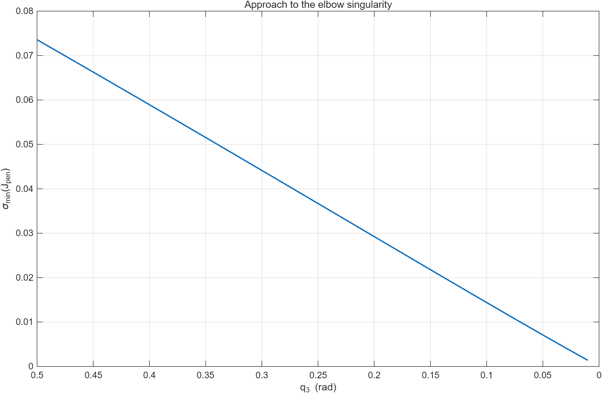
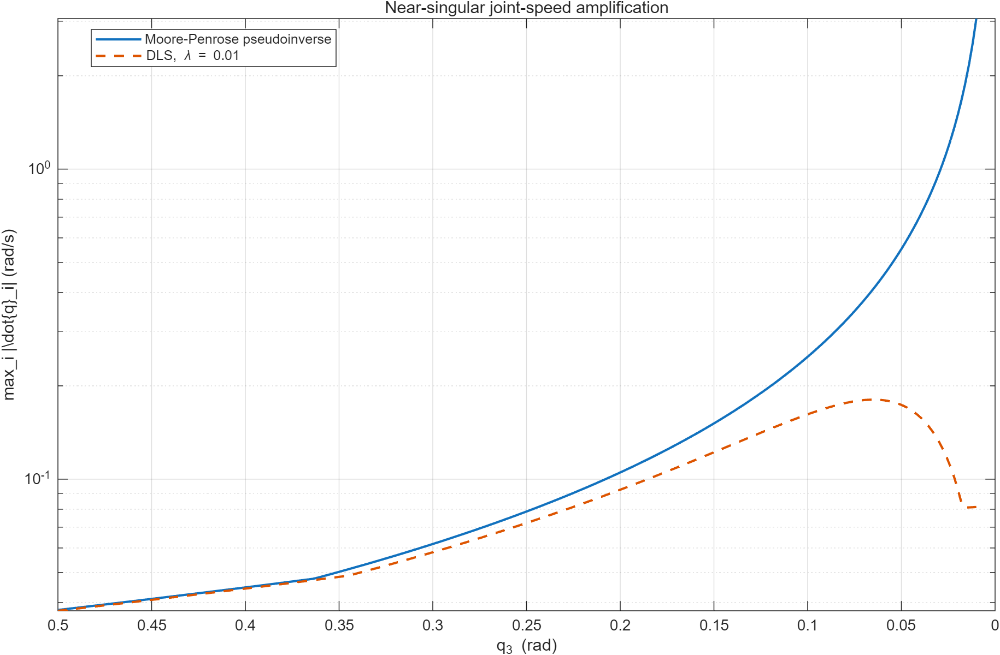
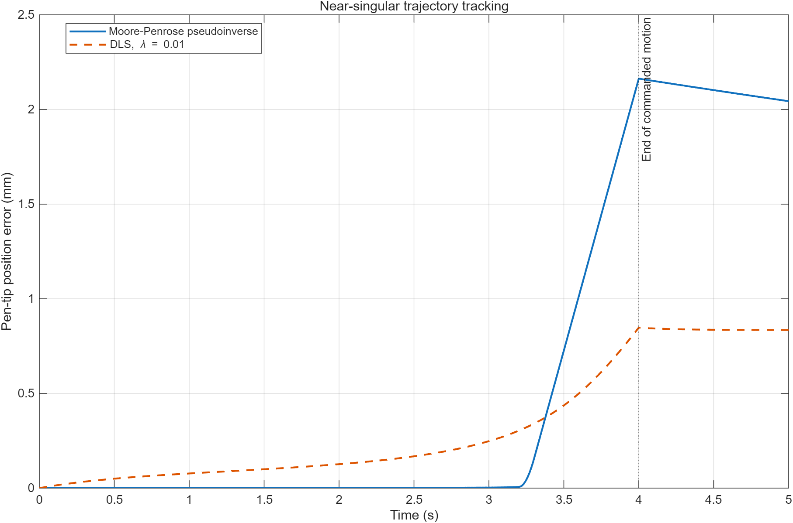
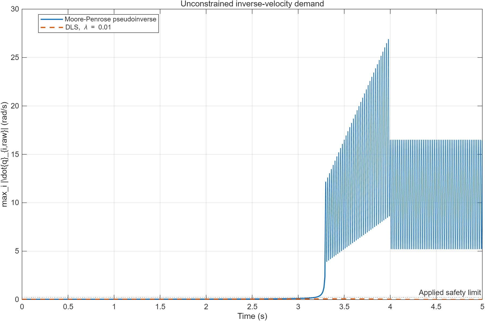
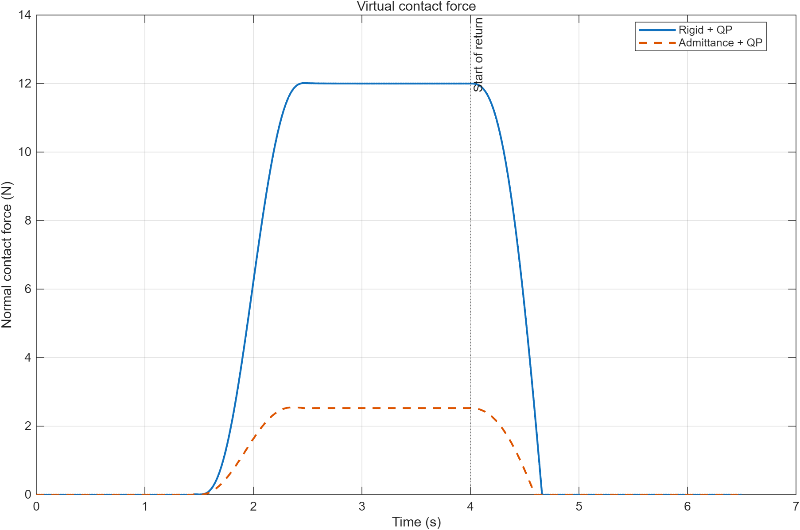
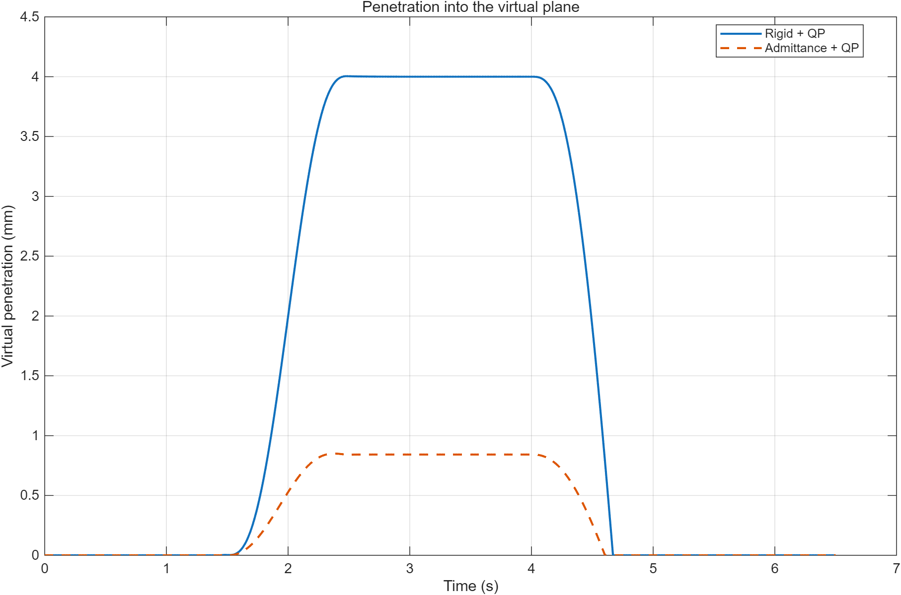
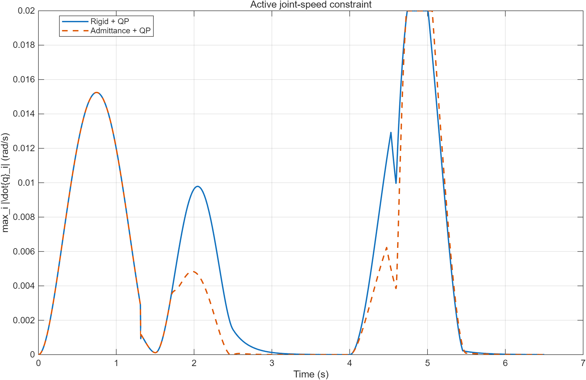
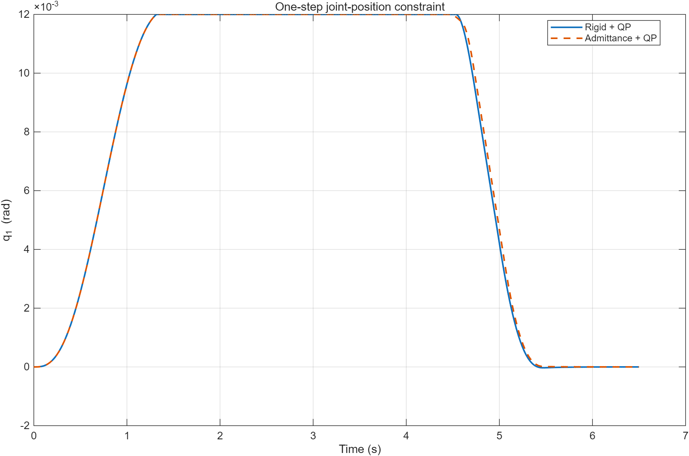

---

## 3. Singularity Analysis and Damped Least-Squares Resolved-Rate Control

This extension investigates the behavior of the UR5e pen-tip Jacobian near an elbow singularity and compares the standard Moore–Penrose pseudoinverse with a damped least-squares inverse.

All experiments in this section are offline MATLAB simulations. They reuse the existing UR5/UR5e forward kinematics and pen-tip Jacobian without sending commands to RViz, URSim, or a physical robot.

### 3.1 Inverse-velocity methods

The original resolved-rate controller uses the Moore–Penrose pseudoinverse:

$$
\dot q_{\mathrm{pinv}}=J_{\mathrm{pen}}^\dagger V_{\mathrm{cmd}}.
$$

Near a singular configuration, a small singular value can produce a very large joint-velocity demand. The damped least-squares method instead solves

$$
\min_{\dot q}
\left\|J_{\mathrm{pen}}\dot q-V_{\mathrm{cmd}}\right\|_2^2
+
\lambda^2\left\|\dot q\right\|_2^2,
$$

with solution

$$
\dot q_{\mathrm{DLS}}
=
J_{\mathrm{pen}}^T
\left(
J_{\mathrm{pen}}J_{\mathrm{pen}}^T+\lambda^2I
\right)^{-1}
V_{\mathrm{cmd}}.
$$

The damping term limits joint-speed amplification at the cost of a controlled task-space residual.

### 3.2 Instantaneous singularity sweep

The script `run_singularity_sweep.m` decreases the third joint angle from

$$
q_3=0.50\ \mathrm{rad}
\quad\text{to}\quad
q_3=0.01\ \mathrm{rad},
$$

while keeping the other joints fixed and commanding a pure pen-tip velocity of

$$
V_{\mathrm{cmd}}
=
[0,\ 0.01,\ 0,\ 0,\ 0,\ 0]^T.
$$

At each configuration, the script records:

- the minimum singular value of the pen-tip Jacobian;
- the Jacobian condition number;
- the pseudoinverse and DLS joint velocities;
- the joint-speed norm and maximum component;
- the task-space velocity residual.

| Minimum singular value | Joint-speed amplification |
|---|---|
|  |  |

The pseudoinverse attempts to preserve the requested Cartesian velocity even as the Jacobian becomes poorly conditioned. DLS regularizes the weak singular directions and prevents excessive joint-speed growth.

### 3.3 Closed-loop near-singular trajectory comparison

A second experiment performs a closed-loop straight-line pen-tip motion toward an elbow-singular region. Both controllers use the same:

- Cartesian feedforward and pose feedback;
- initial joint configuration;
- pen-tip Jacobian;
- integration time step of `0.01 s`;
- whole-vector joint-speed limit of `0.23 rad/s`.

The comparison uses a fixed DLS damping coefficient of

$$
\lambda=0.01.
$$

| Method | Position RMSE (mm) | Maximum error (mm) | Peak raw joint speed (rad/s) | Peak applied speed (rad/s) | Saturation count |
|---|---:|---:|---:|---:|---:|
| Moore–Penrose pseudoinverse | 1.059 | 2.163 | 26.860 | 0.230 | 182 |
| DLS, $\lambda=0.01$ | 0.448 | 0.848 | 0.071 | 0.071 | 0 |

| Tracking error | Raw joint-speed demand |
|---|---|
|  |  |

In this experiment, the pseudoinverse generated a very large unconstrained velocity demand and therefore repeatedly activated the safety scaling. DLS remained below the speed limit and produced smoother motion with lower closed-loop tracking error.

This result does not imply that damping is universally more accurate. Damping introduces a task-space approximation, but it can improve the realized trajectory when the undamped solution is dominated by singular amplification and actuator limits.

### 3.4 Damping-parameter sweep

The script `run_dls_lambda_sweep.m` evaluates

$$
\lambda\in
\{0.005,\ 0.01,\ 0.02,\ 0.03,\ 0.05\}.
$$

The results illustrate the expected regularization trade-off:

| $\lambda$ | Position RMSE (mm) | Peak raw joint speed (rad/s) |
|---:|---:|---:|
| 0.005 | 0.421 | 0.116 |
| 0.010 | 0.448 | 0.071 |
| 0.020 | 0.649 | 0.046 |
| 0.030 | 0.945 | 0.036 |
| 0.050 | 1.545 | 0.026 |

Increasing the damping coefficient suppresses joint motion more strongly, but also increases Cartesian tracking error.

### 3.5 Main files

| File | Purpose |
|---|---|
| `dlsJointVelocity.m` | Computes the regularized inverse-velocity solution |
| `run_singularity_sweep.m` | Performs the instantaneous $q_3$ singularity sweep |
| `simulateRRNearSingularity.m` | Runs the closed-loop pen-tip trajectory simulation |
| `run_rr_near_singularity_comparison.m` | Compares pseudoinverse and DLS control |
| `run_dls_lambda_sweep.m` | Evaluates the damping/error trade-off |
| `so3LogVector.m` | Computes the rotation-error logarithm |

### 3.6 Running the experiments

From the repository root:

```matlab
cd src/singularity_analysis

run_singularity_sweep
run_rr_near_singularity_comparison
run_dls_lambda_sweep
```

Figures, CSV tables, and MAT files are saved in:

```text
src/singularity_analysis/results/
```

---

## 4. Admittance Control with Velocity-Level QP Constraints

This extension adds compliant Cartesian contact behavior and constrained inverse-velocity control to the UR5e pen-tip simulation.

The experiment compares:

1. rigid nominal-trajectory tracking with QP constraints;
2. admittance-modified tracking with the same QP constraints.

Both methods use the same robot model, virtual environment, nominal trajectory, feedback controller, and optimization formulation. The comparison therefore isolates the effect of Cartesian compliance.

### 4.1 Virtual contact model

The environment is represented by a unilateral Kelvin–Voigt plane-contact model.

The penetration depth is

$$
\delta
=
\max\left(
0,\,
n^T(p_{\mathrm{pen}}-p_{\mathrm{plane}})
\right),
$$

and the contact force is

$$
F_{\mathrm{ext}}
=
-\max\left(
0,\,
k_e\delta+d_e\dot\delta
\right)n.
$$

The default environment parameters are:

| Parameter | Value |
|---|---:|
| Plane distance from the initial pen tip | 6 mm |
| Nominal push beyond the plane | 4 mm |
| Environment stiffness $k_e$ | 3000 N/m |
| Environment damping $d_e$ | 30 N·s/m |
| Simulation step | 0.005 s |

### 4.2 Cartesian admittance model

The compliant reference displacement is generated by

$$
M_d\ddot x_a+D_d\dot x_a+K_dx_a=F_{\mathrm{ext}}.
$$

The modified reference is

$$
p_{\mathrm{ref}}=p_{\mathrm{nom}}+x_a,
$$

and the commanded Cartesian twist is

$$
V_{\mathrm{cmd}}
=
\begin{bmatrix}
v_{\mathrm{nom}}
+\dot x_a
+K_p(p_{\mathrm{ref}}-p_{\mathrm{pen}})
\\
K_r\,\log(R_dR^T)^\vee
\end{bmatrix}.
$$

The rigid baseline sets

$$
x_a=\dot x_a=0,
$$

while the admittance controller moves the reference away from the obstacle in response to contact force.

The default admittance matrices are

$$
M_d=2I,\qquad
D_d=80I,\qquad
K_d=800I.
$$

### 4.3 Velocity-level quadratic program

At every simulation step, the joint velocity is obtained by solving

$$
\min_{\dot q}
\frac{1}{2}
\left\|J_{\mathrm{pen}}\dot q-V_{\mathrm{cmd}}\right\|_W^2
+
\frac{\alpha}{2}\|\dot q\|_2^2
+
\frac{\beta}{2}
\|\dot q-\dot q_{\mathrm{prev}}\|_2^2.
$$

The three objective terms respectively penalize:

1. Cartesian tracking error;
2. excessive joint velocity;
3. abrupt changes from the previous joint velocity.

The optimization is subject to joint-speed bounds

$$
-\dot q_{\max}\leq\dot q\leq\dot q_{\max},
$$

and one-step joint-position bounds

$$
\frac{q_{\min}+m-q}{\Delta t}
\leq
\dot q
\leq
\frac{q_{\max}-m-q}{\Delta t}.
$$

The default task weight emphasizes translation over rotation:

$$
W=
\operatorname{diag}
(1,\ 1,\ 1,\ 0.2,\ 0.2,\ 0.2).
$$

The QP is solved with MATLAB `quadprog` using the active-set algorithm.

### 4.4 Virtual-contact comparison

| Method | Peak force (N) | Maximum penetration (mm) | Contact impulse (N·s) | Nominal-path RMSE (mm) | Modified-reference RMSE (mm) |
|---|---:|---:|---:|---:|---:|
| Rigid + QP | 12.015 | 4.004 | 29.618 | 0.0035 | 0.0035 |
| Admittance + QP | 2.550 | 0.850 | 6.253 | 1.870 | 0.0043 |

Relative to rigid tracking, admittance control reduced:

- peak contact force by approximately **78.8%**;
- maximum penetration by approximately **78.8%**;
- contact impulse by approximately **78.9%**.

| Contact force | Virtual penetration |
|---|---|
|  |  |

The larger nominal-path error of the admittance controller is intentional: the controller modifies the nominal trajectory to reduce contact force. Its error relative to the compliant reference remains approximately `0.0043 mm`, showing that the QP controller accurately tracks the modified command.

The maximum admittance-generated reference offset was approximately

$$
3.16\ \mathrm{mm}.
$$

### 4.5 QP constraint stress test

A separate stress test deliberately tightens the software safety envelope:

- joint-speed limit: `0.02 rad/s`;
- narrow upper position bounds for joints 1 and 6;
- one-step position constraints enforced at every iteration.

| Method | Peak speed (rad/s) | Speed-bound activations | Position-bound activations | QP failures | Constraint violations |
|---|---:|---:|---:|---:|---:|
| Rigid + QP | 0.020 | 54 | 644 | 0 | 0 |
| Admittance + QP | 0.020 | 67 | 633 | 0 | 0 |

| Active speed constraint | Active position constraint |
|---|---|
|  |  |

The constraints became active as intended, while the solver reported no failures and no recorded speed or position violations.

### 4.6 Main files

| File | Purpose |
|---|---|
| `defaultContactConfig.m` | Defines robot, environment, admittance, and QP parameters |
| `virtualPlaneContact.m` | Implements unilateral Kelvin–Voigt contact |
| `contactNominalTrajectory.m` | Generates the smooth approach–push–hold–return motion |
| `simulateContactControl.m` | Simulates rigid or admittance contact control |
| `solveVelocityQP.m` | Solves the constrained inverse-velocity QP |
| `computeRecoveryMetrics.m` | Measures force release and tracking recovery |
| `run_contact_comparison.m` | Compares rigid and compliant contact behavior |
| `run_qp_constraint_stress_test.m` | Verifies active speed and position bounds |

### 4.7 Requirements and execution

This section requires:

- MATLAB;
- MATLAB Optimization Toolbox for `quadprog`.

From the repository root:

```matlab
cd src/admittance_qp_control

run_contact_comparison
run_qp_constraint_stress_test
```

Figures, CSV tables, and MAT files are saved in:

```text
src/admittance_qp_control/results/
```

### 4.8 Scope and safety note

These experiments are offline simulations. The joint-angle envelopes and velocity limits are software constraints selected for controller evaluation and stress testing. They are not claimed to be manufacturer-certified UR5/UR5e hardware safety limits.
